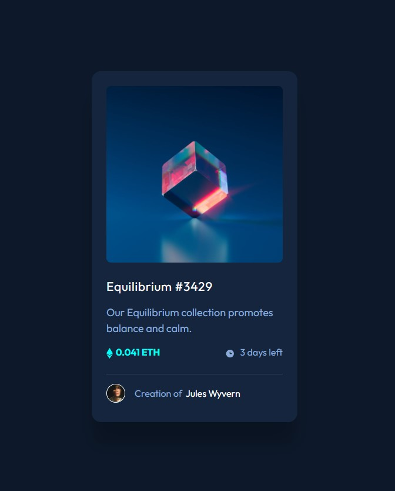

# Frontend Mentor - NFT preview card component solution

This is a solution to the [NFT preview card component challenge on Frontend Mentor](https://www.frontendmentor.io/challenges/nft-preview-card-component-SbdUL_w0U). Frontend Mentor challenges help you improve your coding skills by building realistic projects. 

## Table of contents

- [Overview](#overview)
  - [The challenge](#the-challenge)
  - [Screenshot](#screenshot)
  - [Links](#links)
- [My process](#my-process)
  - [Built with](#built-with)
  - [What I learned](#what-i-learned)
  - [Continued development](#continued-development)
- [Author](#author)

## Overview

### The challenge

Users should be able to:

- View the optimal layout depending on their device's screen size
- See hover states for interactive elements

### Screenshot

### Links

- Solution URL: [GitHub](https://github.com/DekhanFraser/)
- Live Site URL: [Netlify](https://jocular-rolypoly-de529f.netlify.app/)

## My process

### Built with

- Semantic HTML5 markup
- CSS custom properties
- CSS Grid
- Mobile-first workflow

### What I learned

I learnt to use hover states and resolved my biggest issue - the hover overlay for the image with the icon. I still have things to improve, however, it was useful to keep building these cards. I am becoming faster at this.

Also, I made my own little CSS ultility class that I now add to each project before I start work. This class adds the dsign iimge as trannparrent erlay onto the page   alommetreach greatccuracy in reproducing the design.

### Continued development

I need to find better ways to produce image hover effects. I also need to work on my CSS structure as I feel that my CSS file is a bit bloated.

## Author

- GitHub - [@DekhanFraser](https://github.com/DekhanFraser)
- Frontend Mentor - [@DekhanFraser](https://www.frontendmentor.io/profile/DekhanFraser)